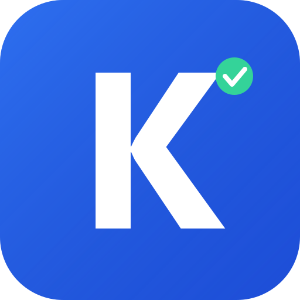

<p align="center">
  
</p>

<h1 align="center">Kandidat</h1>

<p align="center">
  Tracker de candidatures 100% local — pour ne plus jamais perdre le fil de ses recherches de stage, alternance ou emploi.
</p>

<p align="center">
  <a href="https://github.com/quelquun667/App-Kandidat/releases/latest"></a>
  <a href="https://github.com/quelquun667/App-Kandidat/releases"></a>
  <a href="LICENSE"></a>
  
</p>

## Fonctionnalités

- **Suivi complet** — Entreprise, poste, type (stage / alternance / CDI / CDD / freelance), source, date, statut, lien offre, contact RH, notes et prochaines étapes
- **Source / canal** — Candidature spontanée, site carrière, LinkedIn, job board, cooptation, forum/salon ou autre
- **Pipeline visuel** — 7 statuts : Brouillon → Envoyée → Relancée → Entretien → Offre reçue / Refus / Retirée
- **Filtres et tri** — Par statut, type, source, date, recherche textuelle
- **Rappels visuels** — Alertes pour les relances en retard, relances à venir (3j), entretiens à venir (7j)
- **Import / export** — Export CSV ou JSON en un clic ; réimport d'un export JSON en fusion (sans perte, sans doublon)
- **100% local** — Données stockées sur votre machine, aucun serveur, aucun compte
- **Dark mode** — Interface sombre et soignée

## Installation

### Téléchargement

Rendez-vous sur la page [Releases](../../releases/latest) et téléchargez le fichier correspondant à votre système :

| Système | Fichier |
|---------|---------|
| Windows | `Kandidat Setup x.x.x.exe` |
| macOS | `Kandidat-x.x.x.dmg` |
| Linux | `Kandidat-x.x.x.AppImage` ou `.deb` |

### Windows

Lancez `Kandidat Setup x.x.x.exe`. L'application sera disponible dans le menu Démarrer et sur le Bureau.

### macOS

Ouvrez le `.dmg` et glissez Kandidat dans le dossier Applications.

### Linux

```bash
# AppImage
chmod +x Kandidat-*.AppImage
./Kandidat-*.AppImage

# Debian/Ubuntu
sudo dpkg -i kandidat_*.deb
```

## Développement

### Prérequis

- Node.js 20+
- npm

### Commandes

```bash
# Installer les dépendances
npm install

# Lancer en mode dev (navigateur)
npm run dev

# Lancer en mode dev (Electron)
npm run electron:dev

# Construire l'installeur
npm run electron:build
```

## Stack technique

- React 18
- Vite
- Electron
- localStorage + fichier JSON persistant (AppData)
- Zéro dépendance serveur

## Stockage des données

Les candidatures sont sauvegardées localement dans :

- **Windows** : `%APPDATA%/kandidat/data/candidatures.json`
- **macOS** : `~/Library/Application Support/kandidat/data/candidatures.json`
- **Linux** : `~/.config/kandidat/data/candidatures.json`

Les données persistent même en cas de mise à jour ou de réinstallation.

## Star History

<a href="https://star-history.com/#quelquun667/App-Kandidat&Date">
  
</a>

## Licence

MIT
